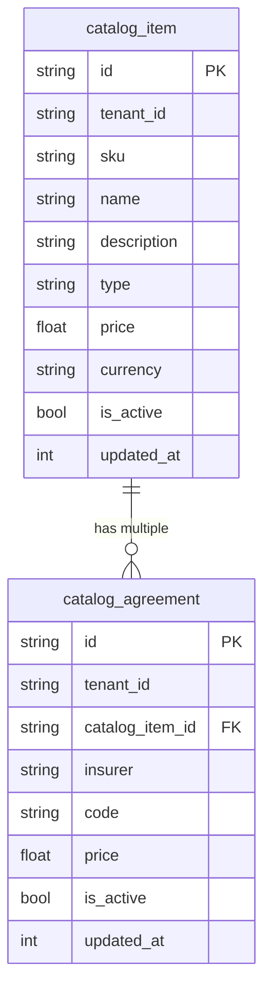

# Database Schema

```mermaid
erDiagram
    catalog_item {
        string id PK
        string tenant_id
        string sku
        string name
        string description
        string type
        float price
        string currency
        bool is_active
        int updated_at
    }

    catalog_agreement {
        string id PK
        string tenant_id
        string catalog_item_id FK
        string insurer
        string code
        float price
        bool is_active
        int updated_at
    }

    catalog_item ||--o{ catalog_agreement : "has multiple"
```
