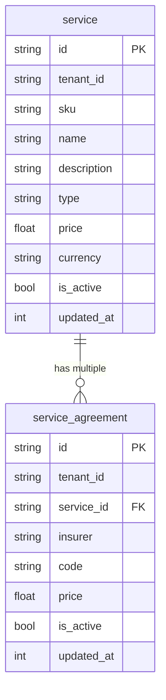

# Database Schema

```mermaid
erDiagram
    service {
        string id PK
        string tenant_id
        string sku
        string name
        string description
        string type
        float price
        string currency
        bool is_active
        int updated_at
    }

    service_agreement {
        string id PK
        string tenant_id
        string service_id FK
        string insurer
        string code
        float price
        bool is_active
        int updated_at
    }

    service ||--o{ service_agreement : "has multiple"
```
