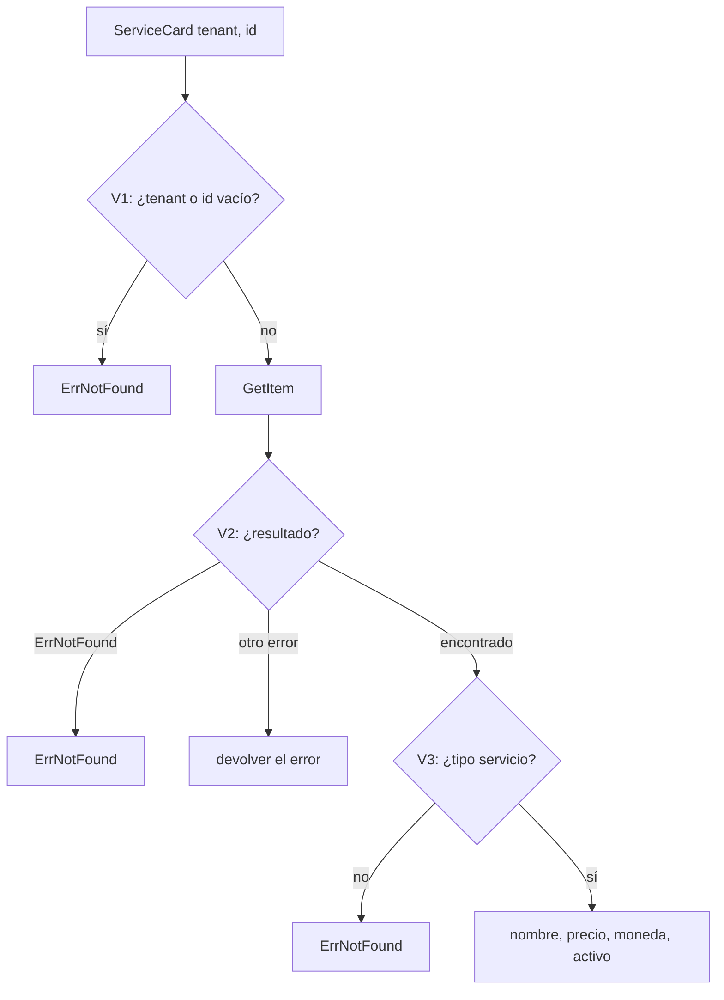

# `ServiceCard` — nombre y precio de lista de un servicio

Cada rombo lleva un id; [`docs/PLAN.md`](../PLAN.md) §3 asigna a cada rama su prueba.

```mermaid
flowchart TD
    A[ServiceCard tenant, id] --> V1{V1: ¿tenant o id vacío?}
    V1 -- sí --> NF0[ErrNotFound]
    V1 -- no --> G[GetItem]
    G --> V2{V2: ¿resultado?}
    V2 -- ErrNotFound --> NF[ErrNotFound]
    V2 -- otro error --> E[devolver el error]
    V2 -- encontrado --> V3{V3: ¿tipo servicio?}
    V3 -- no --> NF2[ErrNotFound]
    V3 -- sí --> OK[nombre, precio, moneda, activo]
```
